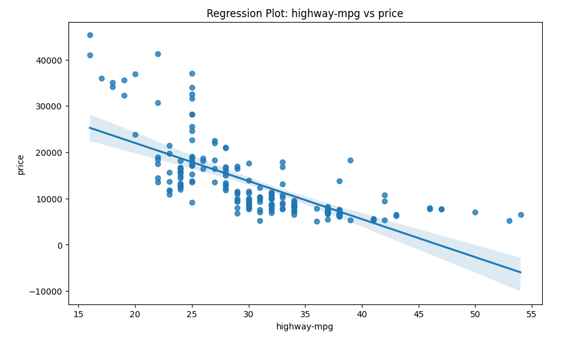
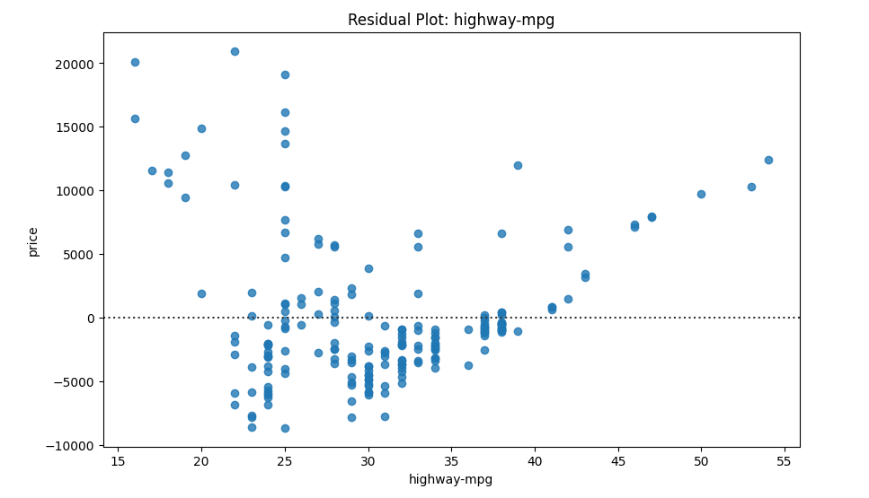
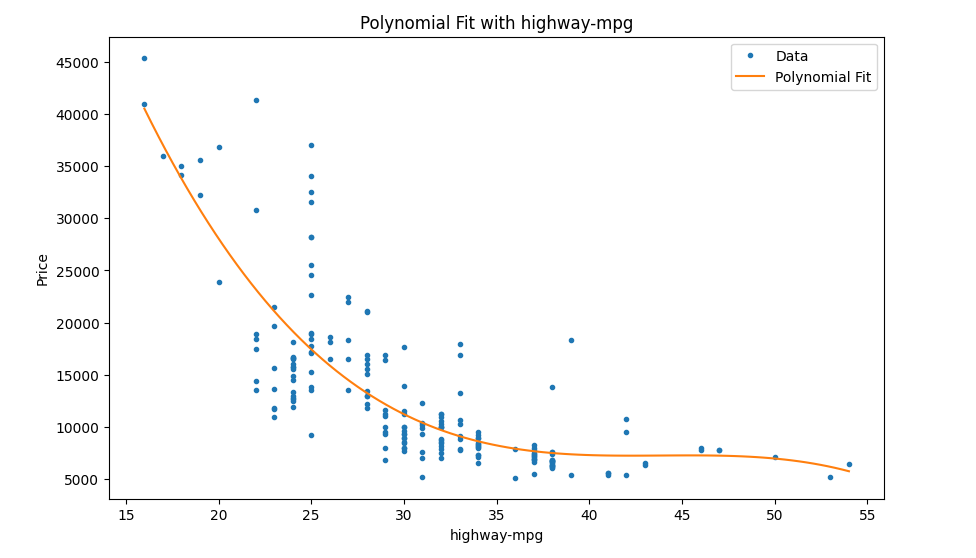
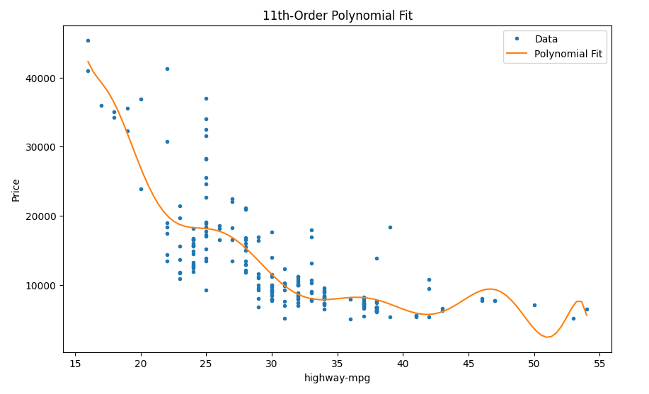

# car-price-modeling-case-study
Predicting car prices using regression models and evaluating performance with visualization and metrics.
# Car Price Regression Analysis

## Overview
This project explores how different regression models can be used to predict car prices using an automobile dataset. The goal is to understand relationships between variables and evaluate model performance using both visualization and quantitative metrics.

---

## Problem
Car prices are influenced by multiple factors such as engine size, fuel efficiency, and horsepower. A simple linear model may not fully capture these relationships.

This project investigates:
- Whether a linear model is sufficient
- How multiple variables improve predictions
- When more complex models lead to overfitting

---

## Approach

### 1. Simple Linear Regression
- Predictor: `highway-mpg`
- Target: `price`
- Found a **negative relationship**:
  - Higher fuel efficiency → lower price

### 2. Multiple Linear Regression
- Predictors:
  - horsepower
  - curb-weight
  - engine-size
  - highway-mpg
- Improved predictions by combining multiple variables
- Demonstrated how relationships change when controlling for other features

### 3. Model Evaluation (Visualization)
- Used regression plots to assess relationships
- Used residual plots to validate model assumptions

### 4. Polynomial Regression
- Applied a 3rd-degree polynomial model
- Captured **non-linear relationships** in the data

### 5. Overfitting Demonstration
- Built an 11th-degree polynomial model
- Showed how excessive complexity leads to **overfitting**

### 6. Pipeline
- Combined:
  - Standardization
  - Polynomial transformation
  - Linear regression
- Streamlined preprocessing and modeling

---

## Key Visualizations

### Regression Plot

Shows a clear **negative linear relationship** between highway-mpg and price.

---

### Residual Plot

Reveals a **pattern in residuals**, indicating that a simple linear model is not sufficient.

---

### Polynomial Fit (Improved Model)

Captures the **curvature in the data**, providing a better fit than linear regression.

---

### 11th-Order Polynomial Fit (Overfitting Example)

Demonstrates **overfitting**, where the model captures noise instead of the true trend, resulting in an unstable curve.

---

## Results

| Model | Insight |
|------|--------|
| Simple Linear Regression | Captures general trend but misses non-linearity |
| Multiple Linear Regression | Improves accuracy using multiple features |
| Polynomial Regression | Better fits curved relationships |
| High-degree Polynomial | Overfits and performs poorly on new data |

---

## Key Insights
- Fuel efficiency (`highway-mpg`) has a **negative relationship** with price
- Engine size and horsepower have **positive relationships**
- Residual plots are critical for validating model assumptions
- Increasing model complexity improves fit, but can reduce generalization
- The **best model balances accuracy and simplicity**

---

## Tools & Technologies
- Python
- Pandas
- NumPy
- Matplotlib & Seaborn
- Scikit-learn

---

## Conclusion
This project demonstrates how different regression techniques impact model performance. While more complex models can improve fit, they may also introduce overfitting. Multiple Linear Regression provides the best balance between interpretability and predictive performance for this dataset.

---

## Author
Linda King
